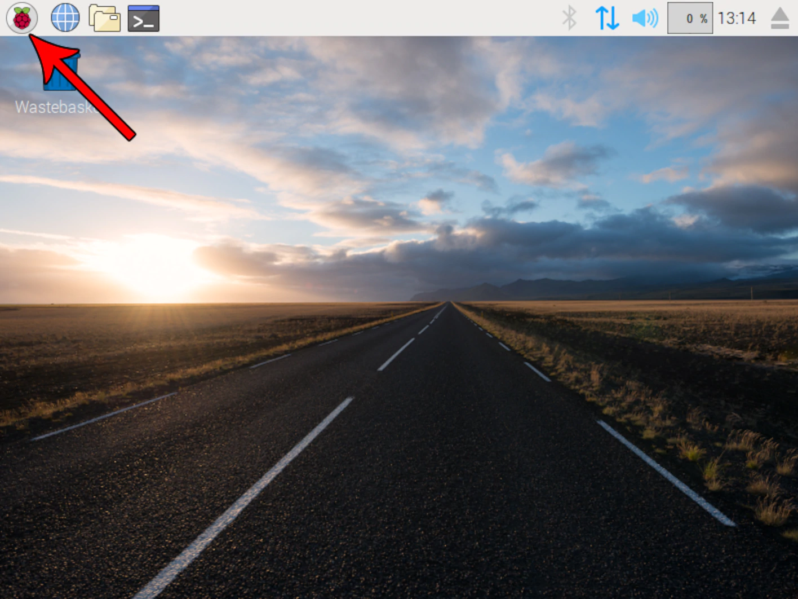
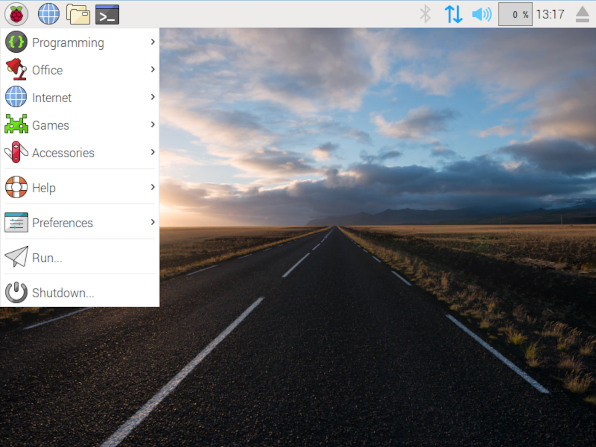
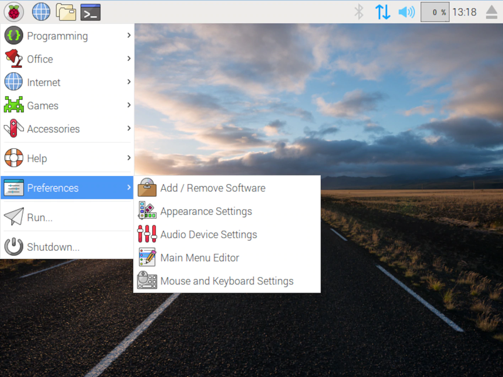
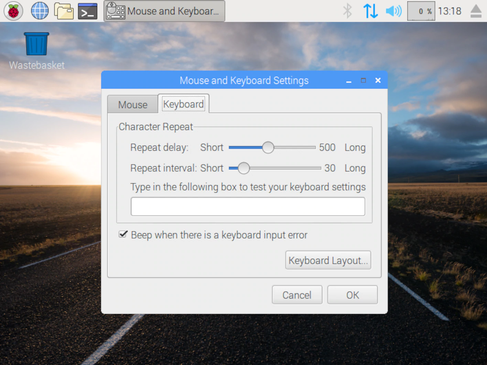

# Configuration & Test du Raspberry

Nous allons rapidement finir de configurer le Raspberry et faire quelques tests afin de vérifier que le montage soit correct.

## Changement clavier

Par défaut le clavier de Raspberry est configuré en QWERTY, pour le changer en AZERTY, suivez ces instructions.

1. Ouvrez le menu principale

2. Cliquez sur `Preferences`

3. Cliquez sur `Mouse and Keyboard Settings`

4. Puis sélectionnez `Keyboard`

5. Sélectionnez `France` dans la partie `Country` et `French` dans la partie `Variant`

## Test du TJBot

[Test du TJBOT](https://github.com/vperrinfr/ptech_IBMFR/blob/master/test_TJBot.md)
