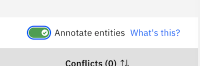

# Tips pour Watson Assistant

* Cliquez sur _Open Context Editor_
* Entrez le nom d'une variable

 

Si vous souhaitez stocker ce que l'utilisateur a saisit _<? input.txt ?>_
Si vous souhaitez une entitée que vous avez récupérer : @[nom de l'entité]

 

Par exemple, j'ai récupéré un numéro de téléphone et je veux le stocker.
 

## Extraire une information particulière (nom, ville...)

Créer une entité **Nom**

Créer une intention **Annotation**

Rajouter des exemples du style 
* Je m'appelle Martin
* Je me nomme Pierre
* Vincent
* Carla
* ...

 

Cliquez sur _Annotate_

 

Cliquez sur le mot (ou ensemble de mot à reconnaitre)

 

Puis sélectionner l'entité que vous avez précedemment sélectionner.

