# Montage du TJBot

Il est temps d'assembler votre robot. Assembler TJBot requiert de la patience et toute votre attention! :-)
Assurez-vous de réserver suffisamment de temps pour l’assemblage de TJBot et **ne vous précipitez pas** .

Commencez par déposer les pièces sur une table plate.

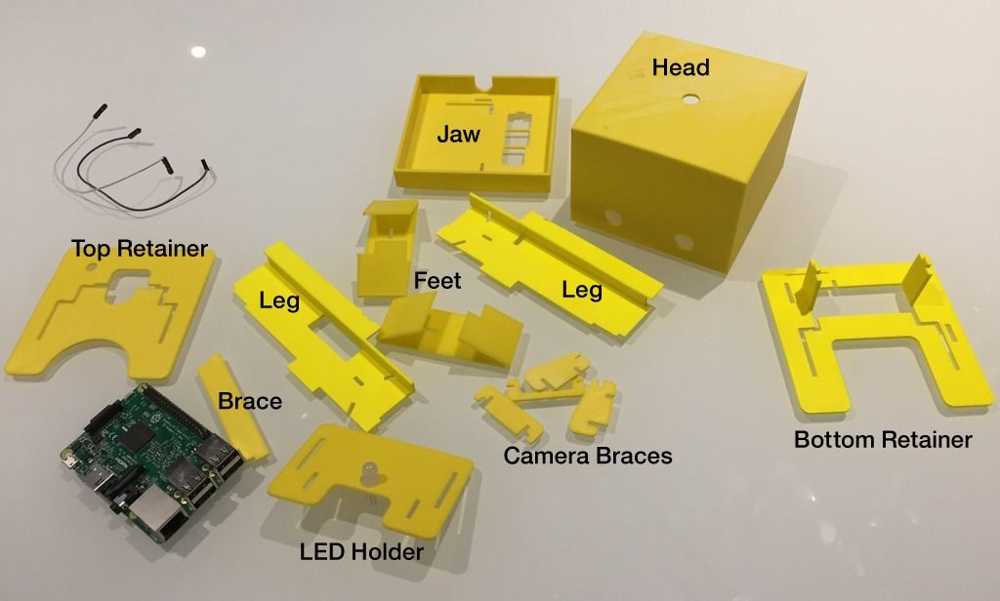

Maintenant, insérez les jambes (legs) dans la mâchoire (jaw). Les jambes vont dans les trous en forme de L dans la mâchoire. 
Insérez les jambes du haut de la mâchoire vers le bas. Il faudra peut-être un peu de force pour pousser les jambes à travers les trous.

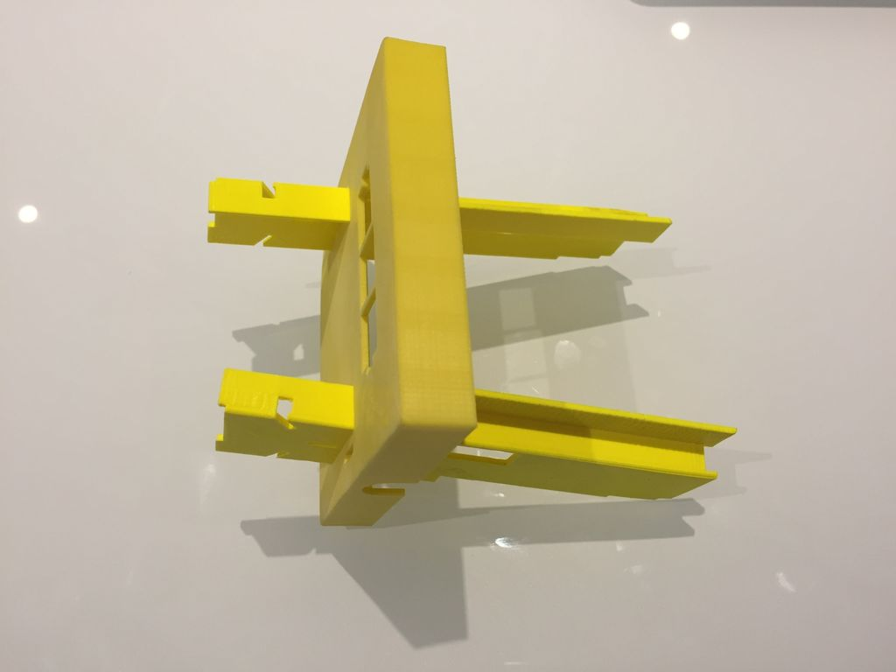

Ensuite, prenez l'attelle (brace) de jambe. Le corset repose dans les deux trous rectangulaires des jambes sous la mâchoire. 
Il garde les jambes droites et soutient la mâchoire. Assurez-vous que le corset est orienté de manière à entrer en contact avec le bas de la mâchoire.

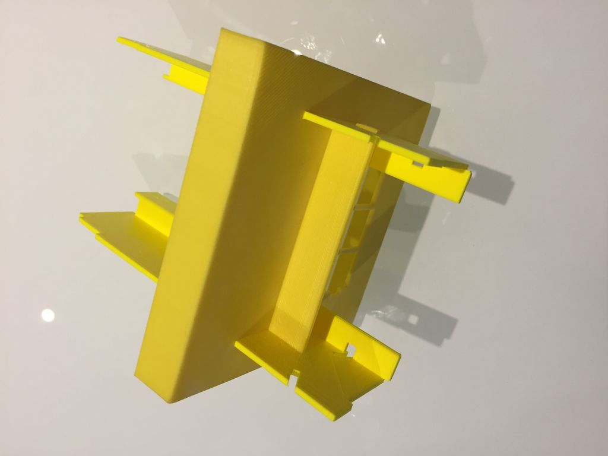

Maintenant, prenez les pieds (feet) et insérez-les dans les encoches de la jambe comme indiqué ci-dessous. Insérez les pieds de l'extérieur de chaque jambe.

Félicitations, vous pouvez maintenant laisser TJBot se débrouiller seul! :-)

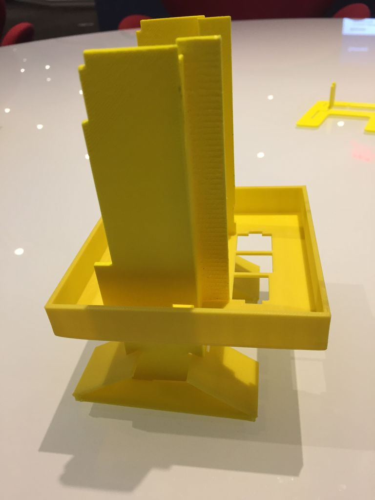

L'insertion du Servo-Moteur (facultatif). Si vous avez un servo, il est temps de l'insérer dans le trou gauche de la mâchoire. 
S'il vous plaît, regarder la vidéo pour plus de détails sur la façon dont le servo est inséré dans cette étape.

Prenez la fixation inférieure (bottom retainer) et faites-la glisser vers le bas à travers les trous en forme de L des pieds. 
Cela peut nécessiter un peu de force, mais travaillez lentement et doucement pour éviter de vous casser les jambes ou le dispositif de retenue. Les bras de support situés au bas de ce dispositif de retenue doivent s’insérer dans les encoches d’accouplement de la mâchoire.

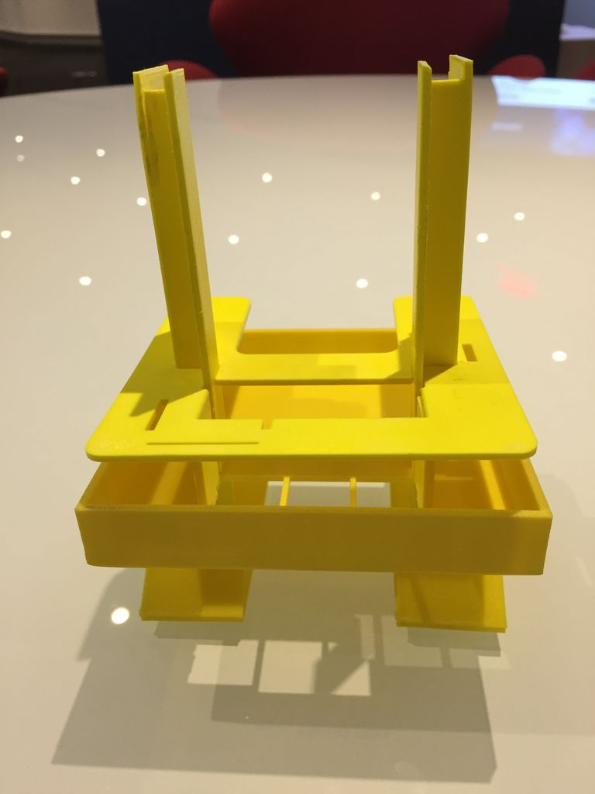

Ensuite, nous allons insérer le Raspberry Pi. Il est monté face cachée et ses ports sont exposés via les trois trous de la mâchoire. Assurez-vous que les broches sont orientées comme indiqué dans l'image ci-dessous.

Insertion de la caméra. Prenez le support de montage de la caméra. Faites glisser les deux supports latéraux de la caméra dans les encoches situées à l'avant du dispositif de retenue.

Glissez votre caméra Pi dans la monture puis ajoutez les renforts supérieur et avant pour que la caméra soit bien ajustée. 
L'image ci-dessous montre le montage de la caméra sans caméra; Veuillez vous reporter à la vidéo ci-dessus pour voir comment la caméra Pi s’intègre dans TJBot.

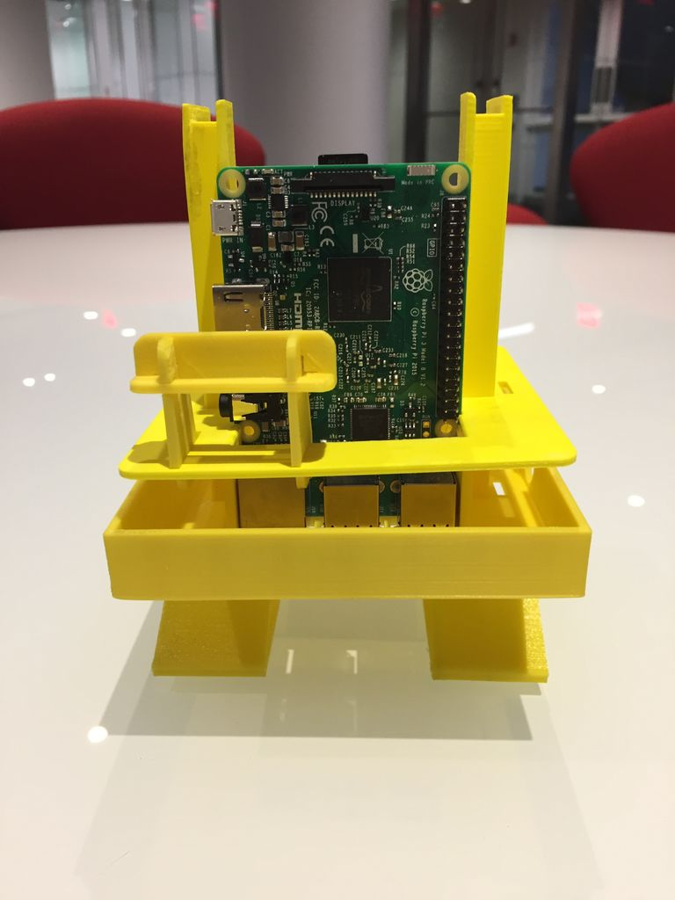

L'élement suivant (Top retainer) est celui avec le petit cercle gravé. 
Ajoutez-le à TJBot en le faisant glisser à travers les trous en forme de L, avec le petit cercle orienté vers la droite (lorsque TJBot est en face de vous). 
Faites glisser le dispositif de retenue vers le bas jusqu'à ce qu'il rencontre le haut du Raspberry Pi.

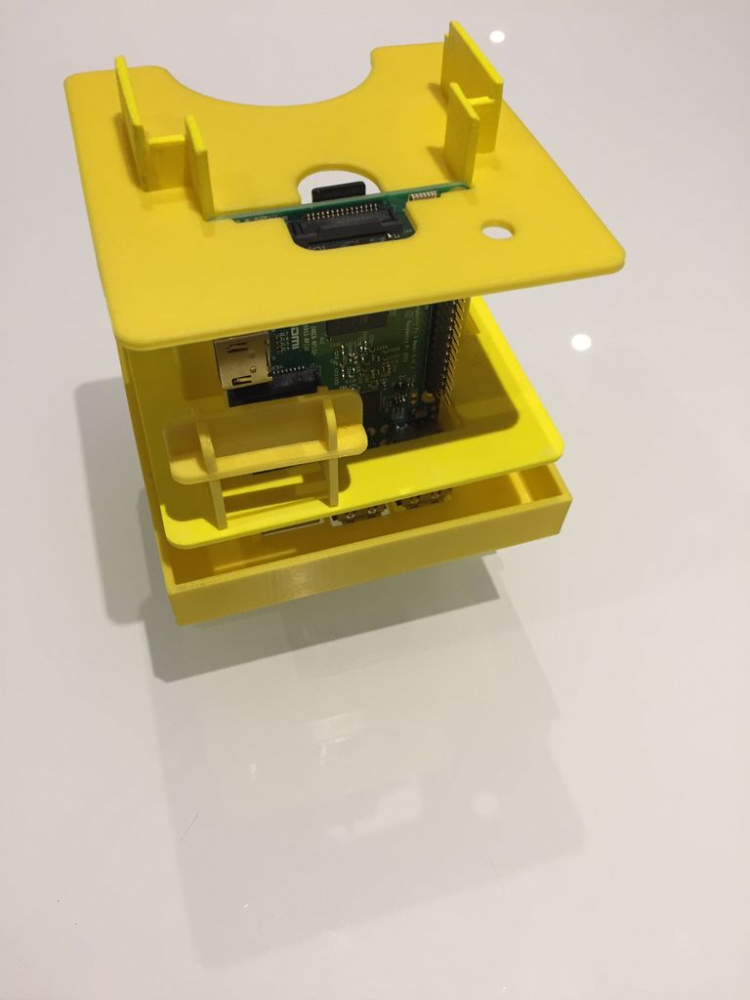

Insérez la LED dans le trou central du petit dispositif de retenue (LED Holder)

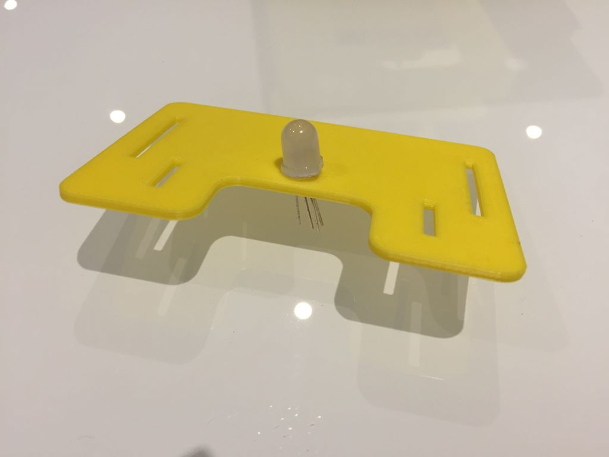

Poussez le dispositif de retenue supérieur avec la LED dans les trous en forme de L des pieds de manière à ce qu’une petite partie seulement des pieds dépasse du trou. 
Passez les fils à travers le petit cercle dans le support du milieu afin qu’ils puissent être connectés au Raspberry Pi.

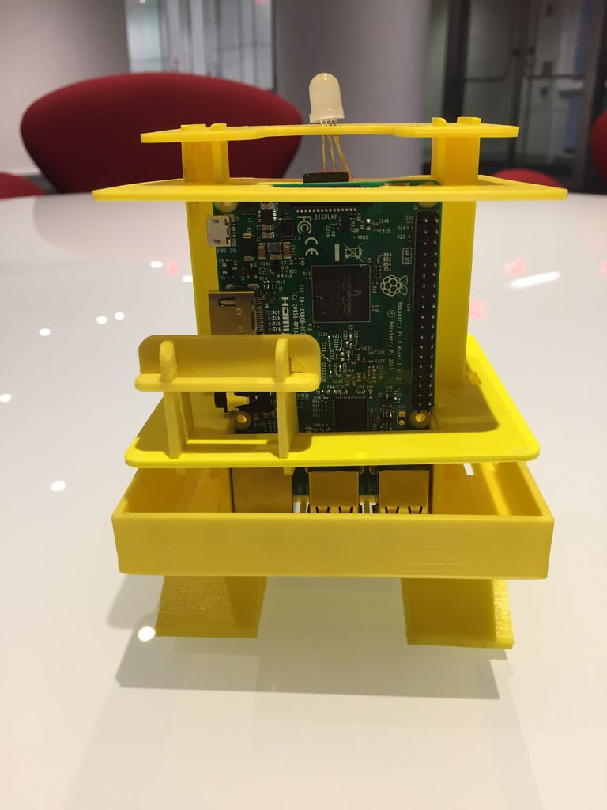

Il vous faut aussi faire le cablage, comme montré sur le schéma ci-dessous.

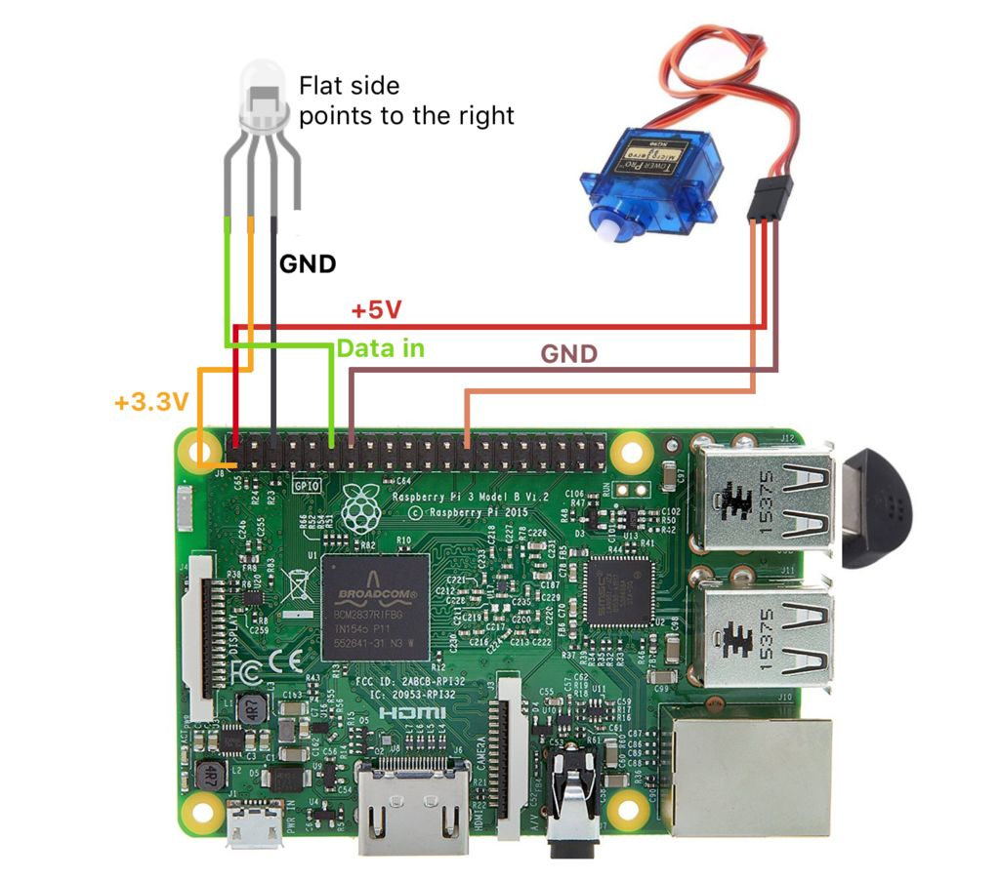

Nous avons presque fini! Les dernières étapes consistent à assembler le bras (arm) et la tête (Head) de TJBot. 

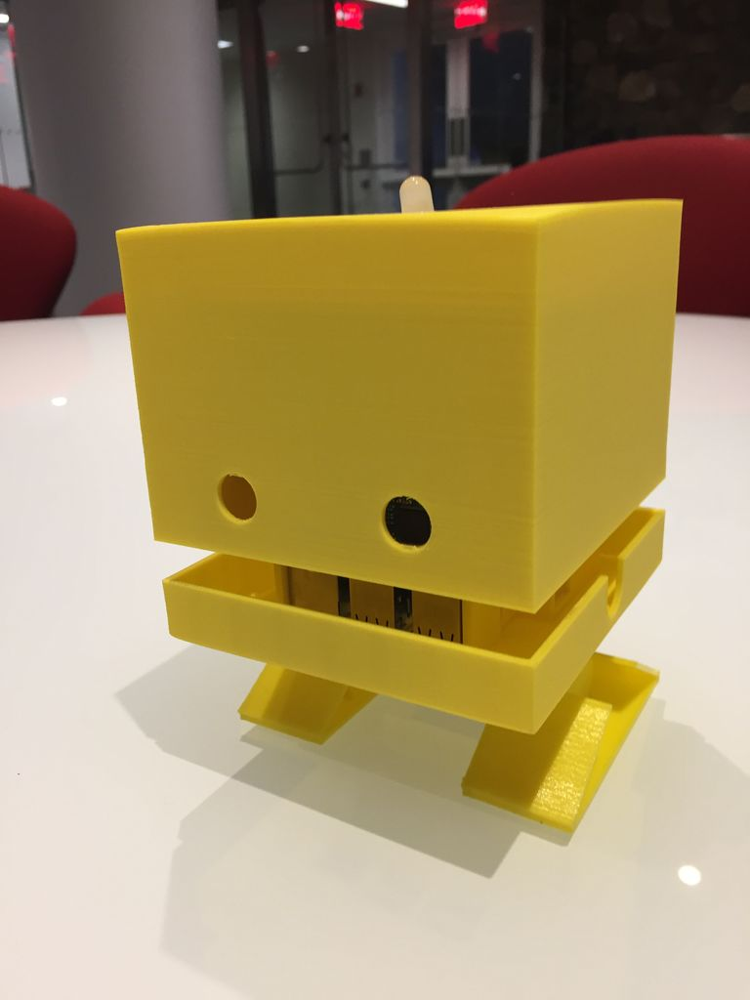

# Test du TJBot

Maintenant, je vous propose de tester le TJBOT
Il vous faut brancher le clavier et souris USB, et le cable VGA sur l'adaptateur HMDI/VGA.

[Test du TJBOT](https://github.com/vperrinfr/ptech_IBMFR/blob/master/test_TJBot.md)
