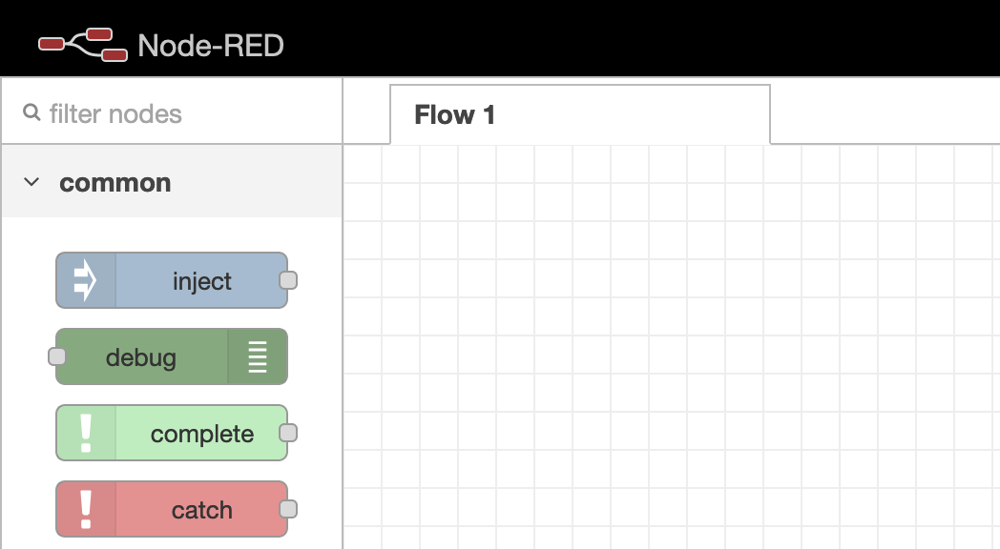
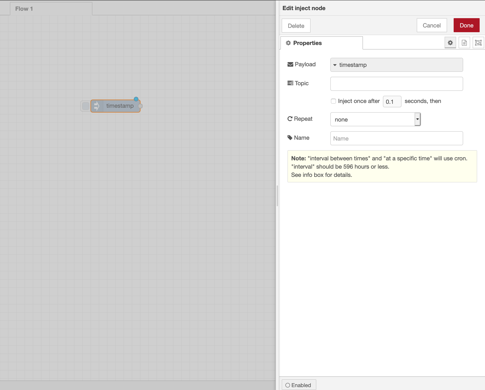
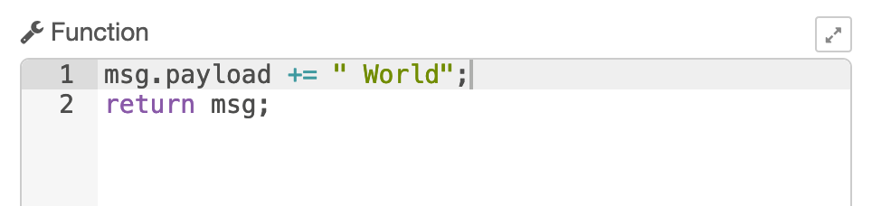
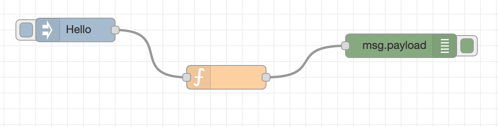
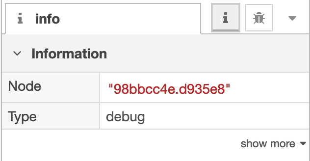

# Welcome to Node-RED

## Introduction

[Node-RED](http://nodered.org) est un outil visuel permettant de câbler l'Internet des objets. Il peut également être utilisé pour d’autres types d’applications afin d’assembler rapidement des flux de services. Node-RED est disponible en tant que solution Open-Source (le code est accessible publiquement) et a été implémenté par l'organisation IBM Emerging Technology.
Node-RED fournit un éditeur de flux basé via un navigateur qui facilite le câblage des flux entre eux à l'aide du large éventail de nœuds.
Tandis que Node-RED est basé sur Node.js, des fonctions JavaScript peuvent être créées dans l'éditeur à l'aide d'un éditeur de texte enrichi. Une bibliothèque intégrée vous permet de sauvegarder des fonctions, des modèles ou des flux utiles pour les réutiliser.

### Créer votre premier flux

Nous allons créer un flux Hello World.

Ce programme est un flux très simple qui imprime le message «Hello World» sur l’écran.

Vous pouvez voir ici l'interface utilisateur de Node-RED. Les blocs colorés à l'écran sont appelés des nœuds. Ils représentent une représentation visuelle d'un morceau de code JavaScript permettant d'exécuter une tâche. Pour créer ce flux 'Hello World', vous devez suivre les étapes suivantes:

1. Cherchez le nœud `Inject` dans la liste de nœuds à gauche

2. Glissez le nœud `Inject` dans la fenêtre centrale
3. Double-cliquez sur le nœud pour voir les options.

4. Utilisez le menu déroulant dans le champ de données pour sélectionner **String** comme données utiles.
5. Tapez 'Hello' dans le champ de données. Cela injectera 'Hello' dans le flux lorsque le nœud d'injection sera lancé. Cliquez sur **done** pour enregistrer et fermer ce nœud.

6. Cherchez le nœud `Function` dans la colonne de droite.
7. Ajoutez un nœud `Function`, ouvrez le et ajoutez le texte suivant à la première ligne de la fonction: `msg.payload += " World";`. Cela ajoutera ' World' à la chaine de caractères.

La fonction complète devrait ressembler à ceci: 

7. Ajoutez un nœud `Debug`.
8. Câblez le nœud `Injecter` au nœud `Function` et le nœud de fonction au nœud `Debug`. La plupart des nœuds ont un cercle gris à gauche, leur port d'entrée, et à droite, leur port de sortie. Un clic gauche sur la sortie et en le faisant glisser vers le port d'entrée du nœud suivant connecte les deux.

9. Cliquez sur `Deploy`. Cela enregistre vos modifications sur le serveur.

Maintenant que vous avez créé votre premier flux Hello World, testez-le en cliquant sur le bouton situé à gauche du nœud `Inject`. Vous verrez des résultats dans la fenêtre de débogage à droite (cliquez sur `Debug` pour changer la vue de info en débogage).

Voici le réusltat que vous devriez obtenir :

## Noeuds utilisés plus tard

Dans cette section, nous allons décrire plusieurs nœuds qui seront utilisés dans les travaux pratiques. Les laboratoires utiliseront ces services pour créer des applications Watson.

### Noeud Change

Définir, modifier ou supprimer les propriétés d'un message.

Le nœud peut spécifier plusieurs règles qui seront appliquées au message à tour de rôle.

Les opérations disponibles sont:

    Set

définit une propriété. La propriété peut être une valeur de chaîne (String) ou faire référence à une autre propriété de message par son nom, par exemple: msg.topic.

    Change

rechercher et remplacer des parties de la propriété.

    Delete

supprimer une propriété.

### Noeud Switch

Un nœud de fonction simple pour router les messages en fonction de ses propriétés.

Lorsqu'un message arrive, la propriété sélectionnée est évaluée par rapport à chacune des règles définies. Le message est ensuite envoyé à la sortie de toutes les règles qui passent.

Remarque: la règle contraire s’applique en tant que "pas n'importe lequel/not any of" des règles qui la précèdent.

### Noeud Template

Crée un nouveau message basé sur le modèle fourni.

Cela utilise le format [Mustache](https://github.com/janl/mustache.js).

Par exemple, pour le modèle suivant:

    Hello {{name}}. Today is {{date}}

recevant le message ci-desssous :

    {
     name: "Fred",
     date: "Monday"
     payload: ...
    }

Le résulat sera :

    Hello Fred. Today is Monday

Et voilà bravo, vous connaissez maintenant les bases de la programmation NodeRed.

### HTTP in node

Ce nœud fournit un nœud d'entrée pour les requêtes HTTP, permettant la création de services Web simples.

Le message résultant a les propriétés suivantes:

    msg.req : http request
    msg.res : http response

Pour les requêtes POST/PUT, le contenu (body) peut être trouvé ici:

    msg.req.body

This uses the Express bodyParser middleware to parse the content to a JSON object.

Par défaut, cela s’attend à ce que le corps de la demande soit encodé dans l’URL:

    foo=bar&this=that

Pour envoyer des données codées en JSON au nœud, l'en-tête de type de contenu (content-type header) de la demande doit être défini sur **application/json**.

Remarque: Ce nœud n'envoie aucune réponse à la demande HTTP. Cela devrait être fait avec un noeud de réponse HTTP ultérieur.

### Noeud de réponse HTTP

Ce nœud peut renvoyer des réponses aux requêtes HTTP reçues d'un nœud d'entrée HTTP.

La réponse peut être personnalisée à l'aide des propriétés de message suivantes:

    payload

est envoyé en tant que corps de la réponse

    StatusCode

si défini, est utilisé comme code d'état de la réponse (par défaut: 200)

    headers

si défini, doit être un objet contenant des paires champ / valeur à ajouter comme en-tête de réponse.
